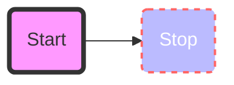
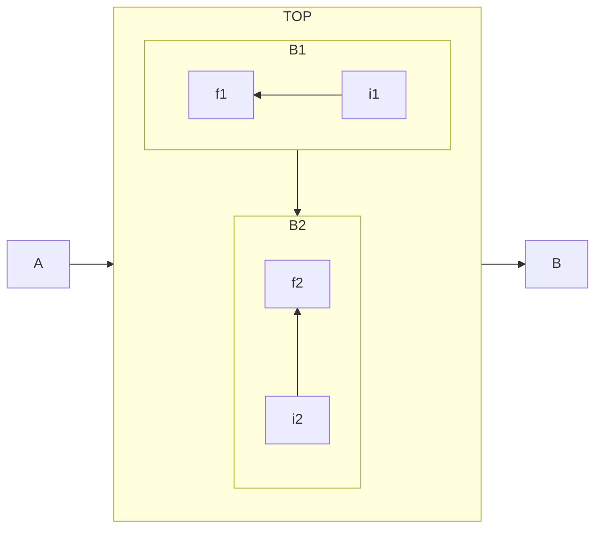

# test

## mermaid





## js to flowchart

[](flowchart.js ":include :type=code js2flowchart")

## katex

```txt
$$E = mc^2$$
```

$$E = mc^2$$

## hightligt text

```txt
==high==
```

==high==

你好啊, ==yong580==, but not to ==this==

## reference link

```txt
This is a quote from Donald Duck literature[^duck]. But python doesn't think so[^python].

1. [-duck] life is too short, I use python
1. [-python] why cue me?
```

This is a quote from Donald Duck literature[^duck]. But python doesn't think so[^python].

1. [-duck] life is too short, I use python
1. [-python] why cue me?
